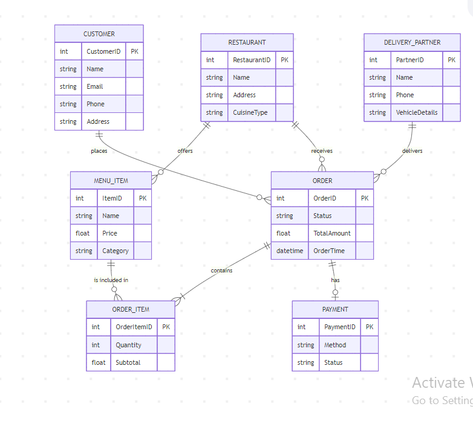

# Software Requirements Specification (SRS)
## for Food Mate - Online Food Delivery System

**Prepared by**: Your Name/Team  
**Date**: August 2026

---

## 1. Introduction

### 1.1 Purpose
The purpose of this Software Requirements Specification (SRS) is to outline the business, system, and user requirements for the development of "Food Mate," an integrated online food delivery system based in Melbourne. Food Mate aims to provide an online portal offering a wide selection of restaurants without charging a service fee for ordering, setting itself apart from rival portals. This document provides a detailed description of the system features, interfaces, design specifications, and non-functional requirements to ensure a seamless experience for customers, restaurant partners, delivery partners, and system administrators.

### 1.2 Document Conventions
This document adheres to standard formatting conventions to ensure clarity:
- **Bold headings** are used for distinct sections and subsections.
- Functional requirements are categorized by modules (e.g., Customer, Restaurant, Admin).
- The term "System" refers to the entire Food Mate platform.

### 1.3 Intended Audience and Reading Suggestions
- **Developers**: To comprehend the architecture, software constraints, and specific technical implementation needs (e.g., PHP, MySQL, API endpoints).
- **Project Managers**: To monitor project scope, deliverables, and alignment with business objectives.
- **Testers**: To create comprehensive test cases according to functional and non-functional specifications.
- **End Users (Restaurants & Admins)**: To gain an understanding of how they will interact with the system's management tools.

---

## 2. Overall Description

### 2.1 Product Perspective
Food Mate will be a fully functional web-based e-commerce platform with responsive design for various devices. It is divided into three primary interface realms:
1. **Customer Frontend**: Where users browse menus, add items to the cart, and securely checkout.
2. **Partner Dashboard (Restaurant & Delivery)**: Where restaurants manage their menus and orders, and delivery partners track assigned deliveries.
3. **Admin Backend**: A centralized dashboard for system owners to manage users, restaurants, monitor sales analytics, and resolve disputes.

### 2.2 Product Functions
The system provides several core functions:
- **User Management**: Registration, authentication, role-based access control, and profile updates.
- **Restaurant Management**: Registration, profile setup, menu creation (categories, items, prices, images), and order acceptance/rejection.
- **Customer Ordering**: Restaurant browsing, filtering by rating/cuisine, cart management, discount application, and secure checkout.
- **Order Management & Tracking**: Real-time order tracking (Preparing, Out for Delivery, Delivered) and notifications via email/SMS.
- **Delivery Partner Module**: Order assignment, real-time status updates, and delivery history.
- **Admin Oversight**: Comprehensive reporting, commission management, user moderation, and customer review moderation.

### 2.3 User Classes and Characteristics
1. **Customers**: End-users browsing the platform and making purchases. They expect an intuitive UI, fast load times, and secure transactions. Technical expertise ranges from low to high.
2. **Restaurant Owners/Staff**: Users managing their menu and incoming orders. They require clear notifications, easy menu editing, and a robust order queue interface.
3. **Delivery Partners**: On-the-go users needing quick access to order pick-up and drop-off information, largely via mobile devices.
4. **Administrators**: System owners with full access to reporting, financial oversight, and moderation tools. They have high technical proficiency.

### 2.4 Operating Environment
- **Client Side**: Responsive web interfaces supporting modern browsers (Chrome, Firefox, Safari, Edge) on desktop computers (Windows, macOS), laptops, tablets, and smartphones (iOS, Android).
- **Server Side**: Hosted on Linux-based servers (e.g., Ubuntu) running a LAMP stack (Linux, Apache, MySQL, PHP).

### 2.5 Design and Implementation Constraints
- **Technical Constraints**: Using PHP/MySQL (PSR-12 standard) and a modular architecture.
- **Security Constraints**: Strict adherence to privacy-by-design, data anonymization, and encryption protocols for payment and user data.
- **Time/Budget Constraints**: The project must be developed within a capstone trimester timeline (approx. 12 weeks), necessitating efficient scoping and the use of cost-effective shared/cloud hosting.

### 2.6 User Documentation
- **User Manual**: Step-by-step guides for customers and delivery partners (e.g., FAQ sections).
- **Admin/Restaurant Guide**: Detailed instructions on dashboard operations, commission tracking, and menu management.

### 2.7 Assumptions and Dependencies
- **Payment Gateway**: The system relies on a third-party secure API (e.g., Stripe, PayPal) for credit card processing.
- **Notification Services**: Depends on third-party SMTP and SMS gateway APIs for timely order alerts.
- **Database Scalability**: Assumes MySQL replication/partitioning can be effectively implemented for performance at scale.

---

## 3. External Interface Requirements

### 3.1 User Interfaces
The Food Mate interface will follow strict UI/UX standards:
- **Navigation**: Clear, persistent navigation bar for easy access to account, cart, and search functions.
- **Responsiveness**: Mobile-first approach using frameworks like Bootstrap for seamless scaling.
- **Feedback Mechanisms**: Instant loaders and toast notifications upon actions (e.g., "Item added to cart", "Invalid login").
- **Error Handling**: A user should never see raw operating system or database errors; clear instructional error messages must be provided.

### 3.2 Hardware Interfaces
- **Client**: Any device with a modern web browser and a stable internet connection.
- **Server**: Cloud-based VPS or dedicated server with a minimum of a Quad-Core CPU, 8GB RAM, and SSD storage to handle at least 500 concurrent users.

### 3.3 Software Interfaces
- **Frontend**: HTML5, CSS3, JavaScript (AJAX for asynchronous data fetching).
- **Backend**: PHP (following PSR-12 coding standards).
- **Database**: MySQL relational database for normalized data storage.

### 3.4 Communications Interfaces
- **Protocols**: All client-server communication will occur over HTTPS to ensure encrypted data transmission.
- **Data Exchange**: JSON via RESTful API patterns or AJAX calls between the frontend and backend.
- **Database Communication**: Using PDO or an ORM with prepared statements to prevent SQL injection.

---

## 4. System Features (Functional Requirements)

### 4.1 User Registration and Authentication
- **Req 1.1**: The system shall allow customers, restaurants, delivery partners, and admins to register with a valid email and password.
- **Req 1.2**: The system shall provide secure login, session management, and logout functionality.
- **Req 1.3**: The system shall enable password reset capabilities via email verification.
- **Req 1.4**: The system shall implement strict role-based access control (RBAC).

### 4.2 Customer Features
- **Profile Management**: View/edit personal details (name, phone) and save multiple delivery addresses.
- **Restaurant Browsing**: Search by name, cuisine, or location. Filter/sort by rating, price, and estimated delivery time.
- **Menu Viewing**: Browse categorized menus, view item details, images, prices, and stock availability.
- **Cart & Checkout**: Add/update/remove items. Apply discount codes. Select a delivery address, provide special instructions, and select a payment method (Cash on Delivery or Online Payment).
- **Order Tracking**: Real-time visualization of order status (Preparing, Out for Delivery, Delivered). Access to itemised order history.
- **Ratings & Reviews**: Submit and edit star ratings and text reviews for completed orders.

### 4.3 Restaurant Features
- **Profile Management**: Manage branding (logo), operational hours, delivery zones, and base charges.
- **Menu Management**: Add, edit, or remove categories and food items. Toggle item availability.
- **Order Management**: Receive incoming orders with customer details. Accept or reject orders. Update status to "Preparing" and "Ready for Pickup."
- **Promotions**: Create restaurant-specific discount codes and view their usage statistics.

### 4.4 Delivery Partner Features
- **Management**: View assigned deliveries with pickup and drop-off routing information.
- **Order Status**: Update statuses to "Picked Up," "Out for Delivery," and "Delivered." View historical delivery records.

### 4.5 Admin Features
- **User/Restaurant Management**: Approve, suspend, or manage user and restaurant accounts. Reset passwords if necessary.
- **Order Oversight**: Monitor all active system orders and view status/payment details for dispute resolution.
- **Financials**: Manage payment processing, track commissions, and view transaction histories.
- **Moderation**: Review, moderate, and delete inappropriate customer reviews.
- **Reporting & Analytics**: Generate and export (CSV/PDF) daily/weekly/monthly sales reports, top-selling items, and delivery performance metrics.

---

## 5. Non-Functional Requirements

### 5.1 Performance Requirements
- **Response Time**: Average page load times must remain under 2 seconds.
- **Concurrency**: The system must support at least 500 concurrent users without performance degradation.
- **Uptime**: Maintain at least 99.5% server availability, excluding planned maintenance.

### 5.2 Safety Requirements
- **Backups**: Automated daily backups of the MySQL database must be scheduled and their integrity verified periodically.
- **Disaster Recovery**: Implement reliable restore procedures to minimize data loss during critical failures.

### 5.3 Security and Privacy Requirements
Security is paramount to establish customer trust. The following measures are mandatory:
- **Data Encryption**: All sensitive data, including passwords (using strong hashing algorithms like bcrypt/Argon2) and payment details, must be encrypted at rest in the database.
- **HTTPS Enforcement**: All data transmission must be secured via TLS/HTTPS.
- **Vulnerability Prevention**: Use prepared statements (PDO) to prevent SQL Injection, and validate/sanitize all inputs to prevent Cross-Site Scripting (XSS).
- **Data Anonymization**: When exporting data for analytics or testing, Personally Identifiable Information (PII) must be anonymized or masked to protect user privacy.
- **Data Protection Impact Assessment (DPIA)**: A DPIA framework will be employed during the design phase to identify and mitigate ethical risks regarding data storage and user tracking, ensuring compliance with privacy-by-design principles.

### 5.4 Software Quality Attributes
- **Maintainability**: Code must follow PSR-12 PHP standards and utilize a modular architecture to simplify future updates.
- **Scalability**: The system should support horizontal scaling of PHP servers and database partitioning/replication.
- **Data Integrity**: Enforce strict referential integrity using foreign keys and utilize database transactions for critical multi-step operations (e.g., checkout and payment confirmation).

### 5.5 Business Rules
- Only verified, registered users may complete an online checkout.
- Delivery assignments are restricted to approved delivery partners.
- Commission percentages are calculated dynamically based on pre-agreed contracts with individual restaurants.
- Refunds can only be initiated by Admins based on the platform's dispute resolution policy.

---

## 6. System Diagrams and Design

### 6.1 Use Case Diagram
The Use Case diagram below illustrates the interactions between the primary actors (Customer, Admin, Restaurant, Delivery Partner) and the system.


### 6.2 Data Flow Diagrams (DFD)

**Level 0 DFD (Context Diagram):**
Provides a high-level overview of the entire Food Mate system and its interactions with external entities.


**Level 1 DFD:**
Breaks down the context diagram into sub-processes like Order Management, Payment Processing, and Menu Browsing.


### 6.3 Entity Relationship Diagram (ERD)
The ERD shows the normalized database structure and the relationships between entities like Users, Orders, Menu Items, and Payments.



### 6.4 Class Diagram
The Class diagram outlines the object-oriented structure of the system's backend architecture.


### 6.5 Sequence Diagram
The Sequence diagram details the time-ordered sequence of messages passed between system objects during a specific use case (e.g., placing an order).


---

## 7. Project Planning and Environment

### 7.1 Files and Folder Structure
The system follows a standard modular web directory structure:
```text
/Foodmate
├── /frontend
│   ├── /css          # Stylesheets (style.css)
│   ├── /js           # JavaScript logic (app.js)
│   ├── index.html    # Customer landing page
│   ├── login.html    # User authentication
│   └── restaurants.html # Restaurant browsing
├── /backend          # API and server logic
├── /database         # SQL schemas and migration scripts
├── /Diagram          # System design diagrams (ERD, DFD, UML)
└── /docs             # Documentation (SRS, WBS, etc.)
```

### 7.2 Implementation and Test Plan

#### Implementation Plan
1. **Requirement Gathering**: Finalize SRS with client sign-off (Current Phase).
2. **System Design**: Develop ERD, DFD, UI Mockups, and Database schemas.
3. **Development Setup**: Provision LAMP stack servers, configure Git repository, and set up staging environments.
4. **Module Development**: 
   - Sprint 1: User Registration, Authentication, RBAC.
   - Sprint 2: Restaurant Module (Menu, Profile).
   - Sprint 3: Customer Order Flow (Browsing, Cart, Checkout, Payment Gateway).
   - Sprint 4: Delivery Partner & Admin Dashboards.
5. **Deployment**: Migrate to production servers, configure SSL, establish CDN for static assets, and execute final data migration.

#### Test Plan
- **Unit Testing**: Validate individual PHP classes and database queries.
- **Integration Testing**: Test API connections (Payment Gateway, Email/SMS API).
- **System Testing**: End-to-end testing of the complete order lifecycle from customer cart to delivery confirmation.
- **Security Testing**: Perform vulnerability scans for SQL injection, XSS, and proper session termination. Verify data encryption and anonymization protocols.
- **User Acceptance Testing (UAT)**: Beta testing with sample restaurants and customers to ensure UI/UX meets usability requirements.

---

## 8. References

1. AltexSoft, 2022. *Non-functional Requirements: Examples, Types, How to Approach*. [online] Available at: https://www.altexsoft.com/blog/non-functional-requirements/
2. Bass, L., Clements, P., & Kazman, R., 2021. *Software Architecture in Practice*. 4th ed. Addison-Wesley Professional.
3. ISO/IEC 25010:2011, *Systems and software engineering — Systems and software Quality Requirements and Evaluation (SQuaRE) — System and software quality models*. International Organization for Standardization.
4. PHP-FIG, n.d. *PSR-12: Extended Coding Style*. [online] Available at: https://www.php-fig.org/psr/psr-12/
5. Zhao, Y., Liu, Q. and Xu, Y., 2021. *RESTful web services: Architecture, design, and implementation*. Journal of Software Engineering and Applications, 14(5), pp.197–209.

> [!NOTE]
> This document serves as the formal agreement of requirements for the Food Mate capstone project. Any changes to the scope defined herein must undergo a formal change request process.
